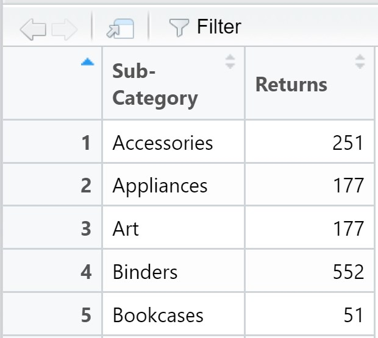
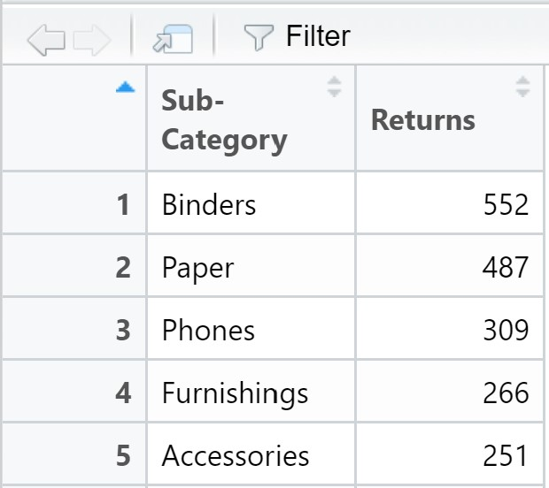
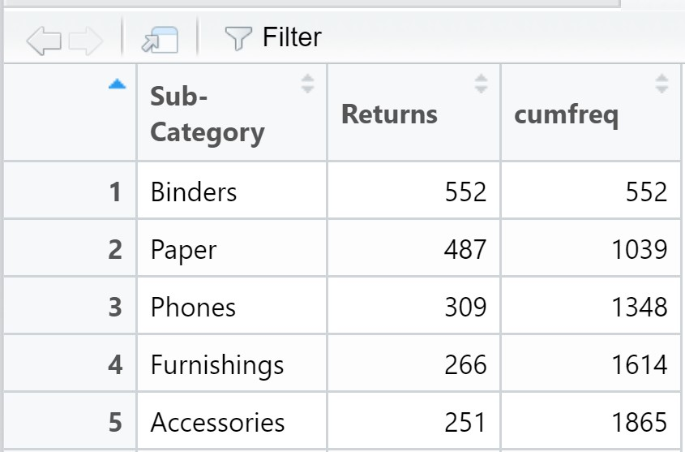
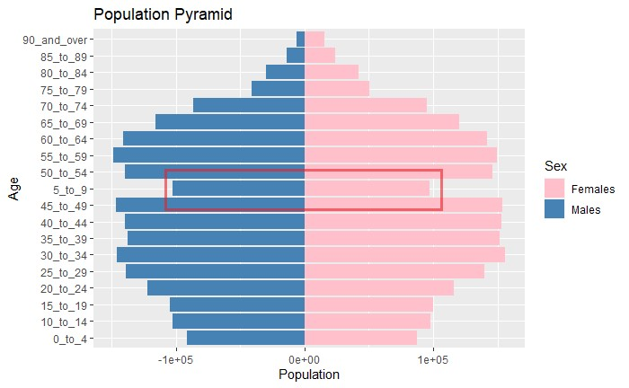

```{r setup, include=FALSE}
knitr::opts_chunk$set(echo = TRUE,
                      eval = TRUE,
                      warning = FALSE,
                      message = FALSE,
                      fig.retina = 3)
```
# Task #1 - Creating a Pareto Chart using ggplot

In this exercise, we are going to create a pareto chart showing the distribution of returns by product sub-category by using a data set from a retail store group.

## Introducing Tidyverse

**Tidyverse** is a collection of R packages that share common philosophies and are designed to work together for doing data science.

```{r, echo = FALSE, fig.align = 'center', out.width = '60%', results = 'markup'} 
knitr::include_graphics("data/image2.jpg")  
```

For the purpose of the exercise, the follow tidyverse packages will be used:

+ [**readxl**](https://readxl.tidyverse.org/) package will be used to read and parse a worksheet into R as a tibble data frame format. (It is important to note that the R object is in tibble data frame and not the generic data frame).
+ [**dplyr**](https://dplyr.tidyverse.org/) package will be used to perform data transformation and data wrangling tasks
+ [**ggplot2**](https://ggplot2.tidyverse.org/) package will be used to build the pareto chart by using the principle of Layered Grammar of Graphs.

### Installing and loading Tidyverse

The code chunk below performs the following three tasks:

+ Create a packaging list called packages.
+ Check if the package(s) on the list have been installed in R, if they have yet to be installed then go ahead to install the missing package(s).
+ Launch the packages in R using library().


```{r}
packages = c('tidyverse', 'readxl', 'knitr')

for (p in packages){
  if(!require(p, character.only = T)){
    install.packages(p)
  }
  library(p, character.only = T)
}
```

## The readr Package

**readr** is one of the tidyverse package.

+ The goal of **readr** is to provide a fast and friendly way to read rectangular data (like csv, tsv, andfwf).
+ It is designed to flexibly parse many types of datafound in the wild, while still cleanly failing whendata unexpectedly changes.

## Importing Data

In this exercise, superstore-2021 data set will be used in this example. It is an MS Excel workbook. It consists of three worksheets, namely: Orders, People and Returns.

The code chunk below imports superstore-2021.xls into R environment by using read_csv() function of **readr** package.

```{r, echo=TRUE, warning=FALSE, message=FALSE}
orders <- read_xls("data/Superstore-2021.xls",
                   sheet = "Orders")
returns <- read_xls("data/Superstore-2021.xls",
                   sheet = "Returns")
```

## Data Wrangling

In this step, the *left_join()* of **dplyr** is used to join the returns data frame and orders data frame by using Order ID as the unique identifier.

```{r}
joined_tab <- left_join(returns, orders,
                        by = c('Order ID' = 'Order ID'))
```

## Compute the frequency count by Sub-Category

Next, we are going to compute the frequency count of returns by sub-category. There are two ways to complete the task. We will be using the *group-by* method.

### The group-by method

In the code chunk below, *group_by()* of dplyr package is used to group the orders by Sub-Category. Then, *summarise()* of dplyr is used to count (i.e. n()) the number of returned orders.

```{r}
freq_returned <- joined_tab %>%
  group_by(`Sub-Category`) %>%
  summarise('Returns' = n()) %>%
  ungroup()
```

### Sorting data 

By default, the values of the tibble data frame is sorted according to the values of the first column. In this case, the values are sorted alphabetically by Sub-Category field as shown in the figure below.

```{r, echo = FALSE, fig.align = 'center', out.width = '60%', results = 'markup'} 
  
```

Before we can compute the cumulative frequency, we need to sort the values in the sub-category field by the values in the Returns field. To accomplish this task, the *arrange()* of **dplyr** package is used as shown in the code chunk below.

```{r}
freq_sorted <- freq_returned %>%
  arrange(desc(Returns))
```

The sorted data frame should look similar to the screenshot below.

```{r, echo = FALSE, fig.align = 'center', out.width = '60%', results = 'markup'} 
  
```

### Computing the cumulative frequency

Out next task is to compute the cumulative frequency of returns by product sub-category. This task will be performed by using *mutate()* of dplyr package and *cumsum()* of Base R.

```{r}
freq_cum <- freq_sorted %>%
  mutate(cumfreq = cumsum(Returns))
```

The newly computed cumulative frequency values will be stored in a new field called cumfreq as shown in the screenshot below.

```{r, echo = FALSE, fig.align = 'center', out.width = '60%', results = 'markup'} 
  
```

### Plotting the Chart

We first plot the distribution of returns by product sub-category

```{r}
ggplot(data = freq_cum, aes(x = reorder(`Sub-Category`,-Returns), y = Returns)) +
   geom_bar(stat = "identity", fill = "light blue", color = "black") +
  labs(title = "Distribution of Returns by Product Sub-Category",
        x = "Sub-Category", y = "Returns") +
    theme(axis.text.x = element_text(angle = 90, vjust = 0.5, hjust=1))
```
#reorder(`Sub-Category`,-Returns)

Next, we add in the cumulative frequency curve for the complete pareto chart.

```{r}
ggplot(freq_cum) +
   geom_bar(aes(x = reorder(`Sub-Category`,-Returns), y = Returns), stat = "identity", fill = "light blue", color = "black") +
  geom_line(aes(x = reorder(`Sub-Category`,-Returns),y=cumfreq,group=1)) +
  labs(title = "Distribution of Returns by Product Sub-Category",
        x = "Sub-Category", y = "Returns") +
  theme(axis.text.x = element_text(angle = 90, vjust = 0.5, hjust=1))
```

# Task #2 - Age-Sex Pyramid

We will be building an age-sex pyramid showing the demographic structure of Singapore by age cohort and gender. For this task, the data entitle Singapore Residents by Planning Area / Subzone, Age Group, Sex and Type of Dwelling, June 2021 should be used. The data set is available at [Department of Statistics home page](https://www.singstat.gov.sg/).

## Loading the Required Packages

For the purpose of the exercise, the follow tidyverse packages will be used:

+ [**readxl**](https://readxl.tidyverse.org/) package will be used to read and parse a worksheet into R as a tibble data frame format. (It is important to note that the R object is in tibble data frame and not the generic data frame).
+ [**dplyr**](https://dplyr.tidyverse.org/) package will be used to perform data transformation and data wrangling tasks
+ [**ggplot2**](https://ggplot2.tidyverse.org/) package will be used to build the pareto chart by using the principle of Layered Grammar of Graphs.

### Installing and loading Tidyverse

The code chunk below performs the following three tasks:

+ Create a packaging list called packages.
+ Check if the package(s) on the list have been installed in R, if they have yet to be installed then go ahead to install the missing package(s).
+ Launch the packages in R using library().

```{r}
packages = c('tidyverse', 'readxl', 'dplyr', 'knitr', 'reshape2')

for (p in packages){
  if(!require(p, character.only = T)){
    install.packages(p)
  }
  library(p, character.only = T)
}
```

## Importing Data

In this exercise, respopagesextod2021 data set will be used in this example. It is an MS Excel workbook. It consists of seven columns, namely: PA - Planning Area, SZ - Subzone, AG - Age Group, Sex - Sex, TOD - Type of Dwelling, Pop - Resident Count, Time - Time / Period.

The code chunk below imports respopagesextod2021.csv into R environment by using read_csv() function of **readr** package.

```{r, echo=TRUE, warning=FALSE, message=FALSE}
respo <- read_csv("data/respopagesextod2021.csv")
```

The respopagesextod2020.csv values will be stored in a new field respo as shown in the screenshot below.

```{r, echo = FALSE, fig.align = 'center', out.width = '60%', results = 'markup'} 
knitr::include_graphics("data/image7.jpg")  
```

## Data Wrangling

Upon observations, we can see that if we were to plot the graph now Age 5_to_9 will appear in the middle of the graph.

```{r, echo = FALSE, fig.align = 'center', out.width = '60%', results = 'markup'} 
  
```

As such, we will be adding a "0" in front of the AG column to make the data flow in descending order.

```{r, echo=TRUE, warning=FALSE, message=FALSE}
respo$AG2 <- stringr::str_pad(respo$AG, 7, side = "left", pad = 0)
```

```{r, echo = FALSE, fig.align = 'center', out.width = '60%', results = 'markup'} 
knitr::include_graphics("data/image9.jpg")  
```

As seen from the image above, we have created a new AG2 column with a "0" in front of the original AG values for ggplot to sort the data better.

## Plotting the Age-Sex Pyramid

```{r, echo=TRUE, warning=FALSE, message=FALSE}
ggplot(respo, aes(x = AG2, fill = Sex,
                 y = ifelse(test = Sex == "Males",
                            yes = -Pop, no = Pop))) + 
  geom_bar(stat = "identity") +
  scale_y_continuous() +
  labs(title = "Population Pyramid", x = "Age", y = "Population") +
    scale_colour_manual(values = c("pink", "steelblue"),
                      aesthetics = c("colour", "fill")) +
  coord_flip()
```