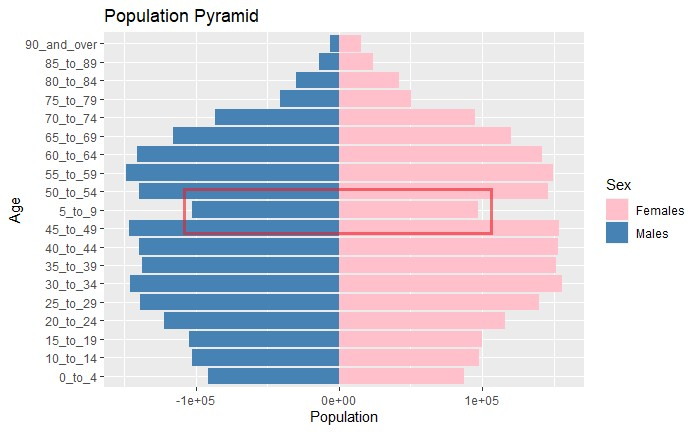

```{r setup, include=FALSE}
knitr::opts_chunk$set(echo = TRUE,
                      eval = TRUE,
                      warning = FALSE,
                      message = FALSE,
                      fig.retina = 3)
```

# Age-Sex Pyramid

A **population pyramid (age structure diagram) or "age-sex pyramid"** is a graphical illustration of the distribution of a population (typically that of a country or region of the world) by age groups and sex; it typically takes the shape of a pyramid when the population is growing. Males are usually shown on the left and females on the right, and they may be measured in absolute numbers or as a percentage of the total population. The pyramid can be used to visualize the age of a particular population. It is also used in ecology to determine the overall age distribution of a population; an indication of the reproductive capabilities and likelihood of the continuation of a species.

```{r, echo = FALSE, fig.align = 'center', out.width = '60%', results = 'markup'} 
  
```
Here's an example of an age-sex pyramid where we can see the population distribution by age and sex for Angola in 2005.

Source: [Wikipedia](https://en.wikipedia.org/wiki/Population_pyramid)

# The Task

In this take-home exercise, we will be applying appropriate interactivity and animation methods we had learned in last week lesson to design an **age-sex pyramid based data visualisation** to show the **changes of demographic structure of Singapore by age cohort and gender between 2000-2020 at planning area level**.

# The Data

For this task, the data sets entitle Singapore Residents by Planning Area / Subzone, Age Group, Sex and Type of Dwelling, June 2000-2010 and Singapore Residents by Planning Area / Subzone, Age Group, Sex and Type of Dwelling, June 2011-2020 should be used. These data sets are available at [*Department of Statistics home page*](https://www.singstat.gov.sg/).

## Installing and Launching R Packages

For the purpose of the exercise, the following packages will be used:

+ [**tidyverse**](https://www.tidyverse.org/) package will be used to perform data transformation and data wrangling tasks
+ [**readxl**](https://readxl.tidyverse.org/) package will be used to read and parse a worksheet into R as a tibble data frame format
+ [**ggplot2**](https://ggplot2.tidyverse.org/) package will be used to build the age-sex pyramid
+ [**gganimate**](https://www.rdocumentation.org/packages/gganimate) package will be used to animate the graphics
+ [**gifski**](https://www.rdocumentation.org/packages/gifski) package will be used to render files as a GIF

```{r}
packages = c('tidyverse', 'readxl', 'knitr', 'gganimate', 'gifski')

for (p in packages){
  if(!require(p, character.only = T)){
    install.packages(p)
  }
  library(p, character.only = T)
}
```

## Importing Data

We will import both datasets using read_csv

```{r}
respo1 <- read_csv("data/respopagesextod2000to2010.csv")
respo2 <- read_csv("data/respopagesextod2011to2020.csv")
```

# Data Wrangling
Since we are building an age-sex pyramid for 20 years worth of data, we will be combining both datasets.

## Combining the data

Before we can merge the data, we first need to check if the datasets have consistent fields.

```{r, echo = FALSE, fig.align = 'center', out.width = '60%', results = 'markup'} 
knitr::include_graphics("data/respo1.jpg")  
```

```{r, echo = FALSE, fig.align = 'center', out.width = '60%', results = 'markup'} 
knitr::include_graphics("data/respo2.jpg")  
```

And since both respo1 and respo2 have the same column headers, we can use [**rbind**](https://www.rdocumentation.org/packages/SparkR/versions/3.1.2/topics/rbind) to combine the two datasets.

```{r}
respo3 <- rbind(respo1, respo2)
```

After combining the two datasets, we can see that they have a **total number of 2025248 rows**.

```{r, echo = FALSE, fig.align = 'center', out.width = '60%', results = 'markup'} 
knitr::include_graphics("data/image2.jpg")  
```

## Cleaning the Data

As mentioned in Take-Home Exercise 1, if we were to plot the graph now **Age 5_to_9** will appear in the middle of the graph instead of appearing second from the bottom.

```{r, echo = FALSE, fig.align = 'center', out.width = '60%', results = 'markup'} 
  
```

As such, we will be adding a "0" in front of the AG column to make the data flow in descending order.

```{r, echo=TRUE, warning=FALSE, message=FALSE}
respo3$AG <- stringr::str_pad(respo3$AG, 7, side = "left", pad = 0)
```

Next, we will be subsetting the data for people only from the **Ang Mo Kio** region.

In this process, we will only keep the columns *PA, AG, Sex, Pop and Time* which will be required to build the population pyramid.

```{r}
respoamk <- subset(respo3, PA =="Ang Mo Kio",
select=c(PA, AG, Sex, Pop, Time))
```

Here's a snapshot of the new dataset:

```{r, echo = FALSE, fig.align = 'center', out.width = '80%', results = 'markup'} 
knitr::include_graphics("data/respoamk.jpg")  
```

We then aggregate the data.

```{r}
respoamk2 <- aggregate(formula = Pop ~ Sex + AG + Time, data = respoamk, FUN = sum)
```

Here's a snapshot of the aggregated dataset:

```{r, echo = FALSE, fig.align = 'center', out.width = '80%', results = 'markup'} 
knitr::include_graphics("data/respoamk2.jpg")  
```

We then draw inspiration from [*Thilo Klein*](https://klein.uk/teaching/viz/datavis-pyramids/) where we switch the male to negative values so they will appear on the left.

```{r}
respoamk2$Pop <- ifelse(respoamk2$Sex == "Males", -1*respoamk2$Pop, respoamk2$Pop)
```

# Building the Population Pyramid

For this portion of the task, it has been brilliantly summarised by [*Siphu Langeni*](https://towardsdatascience.com/population-pyramid-animation-cfa7c1a79a63) in three simple steps:

+ Create the static plot
+ Apply animation parameters
+ Render to file

## The Static Plot

We will be using the [*Thilo Klein*](https://klein.uk/teaching/viz/datavis-pyramids/) method where we flip the axes of the graph to build an age-sex pyramid

```{r}
PopPyramid <- ggplot(respoamk2, aes(x = AG, y = Pop, fill = Sex)) +
  geom_bar(data = subset(respoamk2, Sex == "Females"), stat = "identity") +
  geom_bar(data = subset(respoamk2, Sex == "Males"), stat = "identity") + xlab('Age Group') + ylab('Population') +
  scale_y_continuous(labels = paste0(as.character(c(seq(200, 0, -100), seq(100, 200, 100))), "k")) +
  coord_flip()
```

We then add in axes label

```{r}
PopPyramid <- PopPyramid + 
 labs(
      title = 'Ang Mo Kio Population Estimate 2000 - 2020\n\n{closest_state}',
      y = '\n\nPopulation',
      caption = '\n\nData Source: https://www.singstat.gov.sg/'
     )
```

## Applying the animation parameters

Next, we will use **transition_states** to determine the behavior of the animation. The transition should happen across time, **Year** in this case. The **transition_length** and **state_length** give a relative length of the the transition and state, respectively. 

```{r}
PopPyramid <- PopPyramid + 
  transition_states(
                    Time,
                    transition_length = 1,
                    state_length = 2
                   ) + 
  enter_fade() +
  exit_fade() + 
  ease_aes('cubic-in-out')
```

## Render to file

We will then use **gifski** to fine-tune the file and produce a quality gif

```{r}
animate(
        PopPyramid,
        fps = 24,
        duration = 30,
        width = 500,
        height = 500,
        renderer = gifski_renderer('PopPyramid.gif')
       )
```
# The Animated Graph

Here's the final animated graph showing the population pyramid of Ang Mo Kio planning area. 

```{r, echo = FALSE, fig.align = 'center', out.width = '80%', results = 'markup'} 
  
```

## Observations

The image below shows the comparison between 2020 vs 2000 with 2020 having the darker shade of color

```{r, echo = FALSE, fig.align = 'center', out.width = '80%', results = 'markup'} 
  
```

From the age-sex pyramid, we can observe the phenomenon of an [**ageging population**](https://www.population.gov.sg/our-population/population-trends/ageing-population). 

With increasing life expectancy and low fertility rates, the proportion of Singapore’s citizen population aged 65 years and above is rising rapidly - with large cohorts of “baby boomers” entering the post-65 age range.

This phenomenon can also be observed in other planning areas. The process of creating these pyramids can be achieved by changing the target "PA".

In the example below, we will change the target planning area to **"Hougang"** and only people from Hougang will be selected in our new dataset **"respohg"**

```{r}
#Selecting Hougang as the planning area
respohg <- subset(respo3, PA =="Hougang",
select=c(PA, AG, Sex, Pop, Time))

#Aggregating the Hougang dataset
respohg <- aggregate(formula = Pop ~ Sex + AG + Time, data = respohg, FUN = sum)

#Changing the Male values to negative to flip the chart
respohg$Pop <- ifelse(respohg$Sex == "Males", -1*respohg$Pop, respohg$Pop)
```

As we repeat the earlier process, we can then obtain the following image.

```{r}
#Plotting the age-sex pyramid
PopPyramid2 <- ggplot(respohg, aes(x = AG, y = Pop, fill = Sex)) +
  geom_bar(data = subset(respohg, Sex == "Females"), stat = "identity") +
  geom_bar(data = subset(respohg, Sex == "Males"), stat = "identity") + xlab('Age Group') + ylab('Population') +
  scale_y_continuous(labels = paste0(as.character(c(seq(200, 0, -100), seq(100, 200, 100))), "k")) +
  coord_flip()

#Adding the axes label
PopPyramid2 <- PopPyramid2 + 
 labs(
      title = 'Hougang Population Estimate 2000 - 2020\n\n{closest_state}',
      y = '\n\nPopulation',
      caption = '\n\nData Source: https://www.singstat.gov.sg/'
     )

PopPyramid2 <- PopPyramid2 + 
  transition_states(
                    Time,
                    transition_length = 1,
                    state_length = 2
                   ) + 
  enter_fade() +
  exit_fade() + 
  ease_aes('cubic-in-out')

#Animating the Pyramid
animate(
        PopPyramid2,
        fps = 24,
        duration = 30,
        width = 500,
        height = 500,
        renderer = gifski_renderer('PopPyramid2.gif')
       )
```

We've thus come up with a process that is easily repeatable just by changing a few variables.