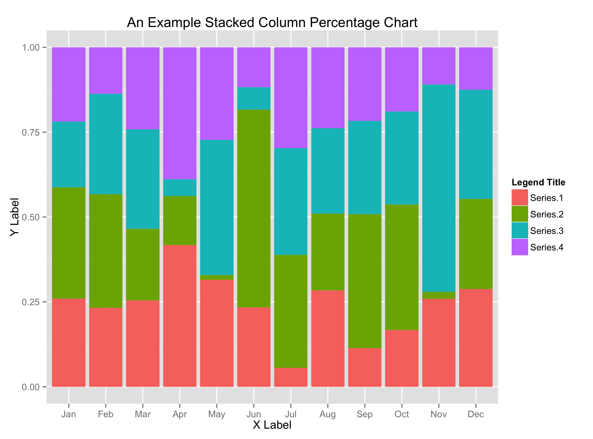
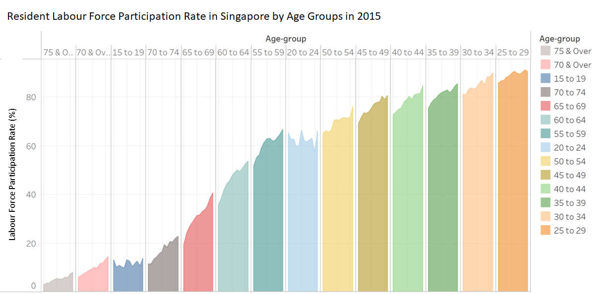
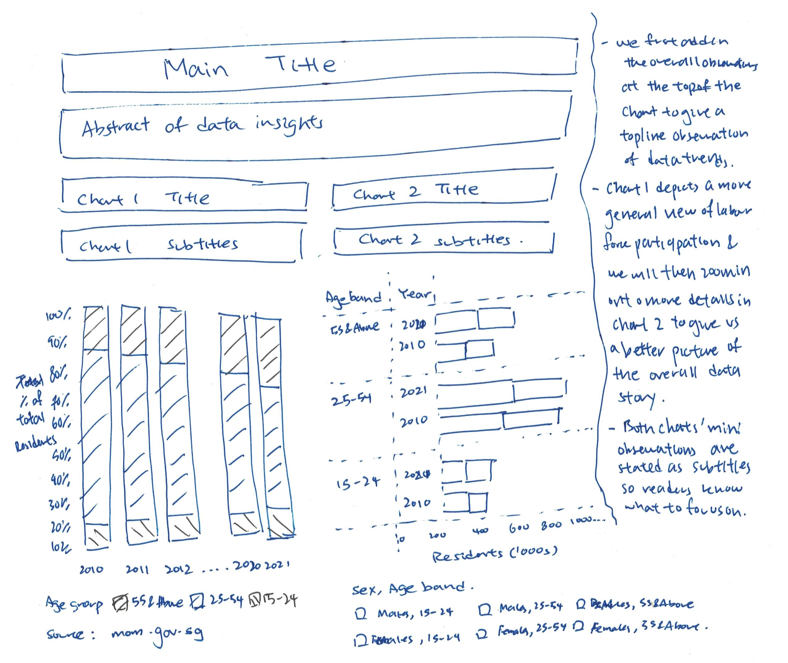
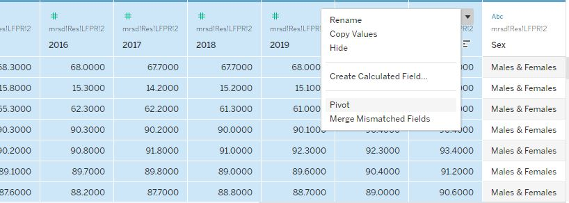
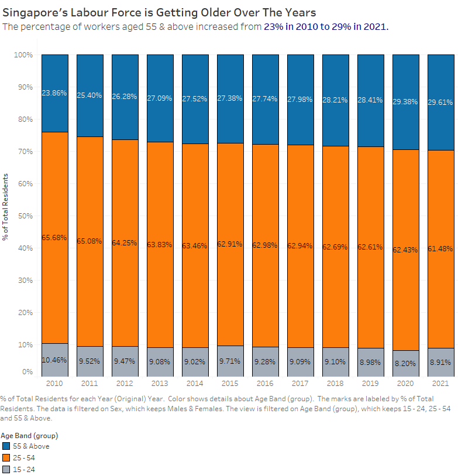
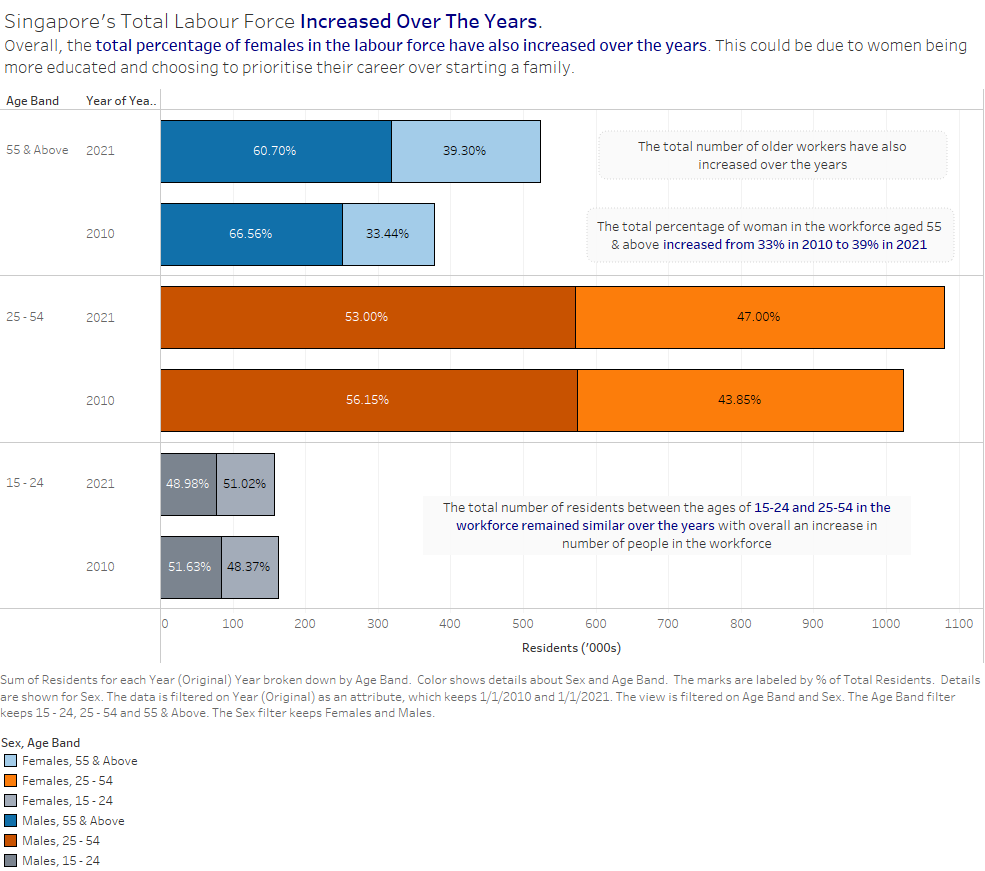

```{r setup, include=FALSE}
knitr::opts_chunk$set(echo = TRUE,
                      eval = TRUE,
                      warning = FALSE,
                      message = FALSE,
                      fig.retina = 3)
```

# 1. Critique of Visualisation

The data visualisation below is created by using data provided by **Ministry of Manpower, Singapore (MOM)**. The data are available under the page entitle [Statistical Table: Labour Force](https://stats.mom.gov.sg/Pages/LabourForceTimeSeries.aspx).


```{r, echo = FALSE, fig.align = 'center', out.width = '100%', results = 'markup'} 
knitr::include_graphics("data/sample.png")  
```
Based on the figure above, we are assuming that the Ministry of Manpower are trying to determine the trend of labour force participation rate in 2015. **The critique below on clarity and aesthetics will be based on this assumption.**


## 1.1 Clarity

### 1.1.1 Confusing Title

The title "Labour force participation rate" is imprecise where it does not inform readers at a glance what the story is the visualisation telling - which is how the labour force participation of 25 to 54 is the highest and people above 55 are still within the workforce due to an [ageging population](https://www.population.gov.sg/our-population/population-trends/ageing-population). 

*Suggested Revision* - Changing the visualisation title

Title should be "Resident Labour Force Participation Rate in Singapore by Age Groups from 2010 - 2021"

### 1.1.2 Improper Chart Type

The current chart does not show the true difference in labour force partipation between age groups at a glance. We can see that the ages 25 to 54 has the highest labour force participation but we cannot easily compare it against other age groups to formulate useful insights.

*Suggested Revision* - Changing the chart type

```{r, echo = FALSE, fig.align = 'center', out.width = '100%', results = 'markup'} 
  
```

We can consider using a stacked column chart type similar to the image above to represent different age groups so the difference in participation can be noted down at a glance.

### 1.1.3 Confusing Axes Label

The current chart has 'Lfpr' as the y-axis label which does not have meaning to an uninformed user. And given how the chart is showing data exclusively for 2015, there should not be a need to repeat the 'year' under the x-axis for all data points.

*Suggested Revision* - Changing the axes label

```{r, echo = FALSE, fig.align = 'center', out.width = '100%', results = 'markup'} 
  
```

We will change the y-axis label to "Labour Force Participation Rate (%)" while removing the x-axis 'year' label completely and adding it to the title.

### 1.1.4 No Data Source

The current visualisation does not include any data source which makes it unreliable.

*Suggested Revision* - Add in the data source

We can add in a text "Source: stats.mom.gov.sg" to make the visualisation more credible

### 1.1.5 No insights annotation

The chart only has a title but no additional insights written to drive across the point of the visualisation.

*Suggested Revision* - Add in annotation under the title

We can add annotations "Ages 25 to 54 has the highest labour force participation followed by ages above 55"

## 1.2 Aesthetics

### 1.2.1 Good use of gridlines and vertical axis

With the current gridlines increasing at 20% each, we can easily see how each age group fares. However, there should be reference lines added at certain percentages to make the data even more visible.

*Suggested Revision* - Adding in reference line

Two reference lines can be added at the 40% and 80% mark to clearly demarket the difference in labour participation rates.

### 1.2.2 Bad usage of colors

Overall, the entire graph is too colorful and divides the reader's attention with so much blinding colors. We can consider segregating each age group into their own individual color so that we can see what story the data is telling at a glance. Instead of giving each individual age groups their own color, the age groups should be colored according to certain clusters e.g 24 & Below, 25-54, 55 & Above

*Suggested Revision* - Color the age groups according to clusters

After clustering the age groups into '24 & Below', '25-54' and '55 & Above' we can then give each cluster a different color to show the difference in labour force participation easily.

### 1.2.3 Bad usage of graph space

The entire graph takes up too much space for just showing one particular year of data. Given the dimensions, we can easily add in a couple more years of data to see the difference between each year.

*Suggested Revision* - Reduce graph size and add in more graphs

We can reduce the graph size and add in similar data for additional years to see the contrast in labour force participation over the years.

## 2. Improved Data Visualisation Sketch

```{r, echo = FALSE, fig.align = 'center', out.width = '100%', results = 'markup'} 
  
```

## 2.1 Advantages of Improved Data Visualisation Sketch

1. The stacked bars in the proposed visualisation allow us to see at a glance the total labour force participation in the various age group. We can easily see how each age band contributes to the makeup of our total labour force.

2. By adding in chart 2, we can also clearly visualise the different of participation of each gender in the workforce and determine whether there has been an increase or decrease in representation for each gender and age band by looking at individual panes.

3. Better usage of graph space where instead of just looking at 2015 labour force participation, we can observe the trends over the years and draw distinct comparison in the changes of the workforce from 2010 to 2021 and determine the relevant trends and actionable insights.

4. By grouping up the age bands, we avoid the usage of so many colors and instead rely on just 3 distinct colors. This allow us to not blind the reader while allowing them to grasp the representation of each age band in the labour force.

5. By going from chart 1 to chart 2, we can do a better data storytelling. We first look at the overall trends in labour force participation for chart 1 before zooming in on individual genders and age band for chart 2 to help us tell a better visual story and inform users to particular interesting labour force trends. 

## 3. Data Visualisation 

After downloading the dataset from Ministry of Manpower website, we will first clean the data using excel before importing it into Tableau for visualisation.

## 3.1 Data Cleaning

We observe that the data table provided in the excel file needs to be altered slightly before being imported into Tableau.

```{r, echo = FALSE, fig.align = 'center', out.width = '100%', results = 'markup'} 
knitr::include_graphics("data/excel1.jpg")  
```
As we only require only data from 2010 - 2021, we will be deleting the columns of data from 1991 to 2009. 

```{r, echo = FALSE, fig.align = 'center', out.width = '100%', results = 'markup'} 
knitr::include_graphics("data/excel2.jpg")  
```

After which, we will be removing rows 1&2 while also removing the white spaces and renaming *Age(Years)/Sex* to *Age Band*.

We also add in an additional column called "Sex" and label the data as "Males & Females", "Males" and "Females" respectively.

```{r, echo = FALSE, fig.align = 'center', out.width = '100%', results = 'markup'} 
knitr::include_graphics("data/excel3.jpg")  
```
We then save this excel file as "data.xls" for later usage.

## 3.2 Data Preparation

We open the file using Tableau and observe the following:

```{r, echo = FALSE, fig.align = 'center', out.width = '100%', results = 'markup'} 
knitr::include_graphics("data/tab1.jpg")  
```
We then pivot our data into **Years**, **Age Band**, **Sex** and **Labour Force**.

```{r, echo = FALSE, fig.align = 'center', out.width = '100%', results = 'markup'} 
  
```

After pivoting the data, the data has been transformed as seen below

```{r, echo = FALSE, fig.align = 'center', out.width = '100%', results = 'markup'} 
knitr::include_graphics("data/tab3.jpg")  
```

We will need to change the third column data type to **'Date'** while renaming it as **'Year'** while also renaming the last column to **'Labour Force'**

```{r, echo = FALSE, fig.align = 'center', out.width = '100%', results = 'markup'} 
knitr::include_graphics("data/tab4.jpg")  
```

We then created a new column with Year as a numerical value by using a calculated field as seen below.

```{r, echo = FALSE, fig.align = 'center', out.width = '100%', results = 'markup'} 
knitr::include_graphics("data/tab5.jpg")  
```

We group the age bands into the three different groups of **15-24**, **25-54** and **55 & Above**.

```{r, echo = FALSE, fig.align = 'center', out.width = '100%', results = 'markup'} 
knitr::include_graphics("data/tab6.jpg")  
```
The new datatable is as seen below

```{r, echo = FALSE, fig.align = 'center', out.width = '100%', results = 'markup'} 
knitr::include_graphics("data/tab7.jpg")  
```

# 4.1 Creation of Graph 1 - Stacked column for Total Population from 2010 to 2021

1. We first drag the Year field to the columns while adding the Residents measure to the rows. 

```{r, echo = FALSE, fig.align = 'center', out.width = '100%', results = 'markup'} 
knitr::include_graphics("data/tab8.jpg")  
```

2. We change the breakdown into % of total using quick table calculation.

```{r, echo = FALSE, fig.align = 'center', out.width = '100%', results = 'markup'} 
knitr::include_graphics("data/tab11.jpg")  
```

3. Similarly, we add the same Sum(Resident) percentage as the label

4. We drag the Sex column to the filters and select only "Males & Females"

5. We drag 'Age Band' to the filter and filter out 'Total'

6. We add 'Age Band' to the colors icon to colour the bar chart by age group

```{r, echo = FALSE, fig.align = 'center', out.width = '100%', results = 'markup'} 
knitr::include_graphics("data/tab12.jpg")  
```

7. We then sort the stacked bars by 'Age Band' to let the older age group appear at the top

8. We edit the chart title and add in annotations to label our chart

The final visualisation of our stacked chart:

```{r, echo = FALSE, fig.align = 'center', out.width = '100%', results = 'markup'} 
  
```

# 4.2 Creation of Graph 2 - Comparing 2010 & 2021 Labour Force Breakdown via Age groups & Sex

1. We create a new datasheet titled 'Comparison' for our new graph

2. We drag the Residents measure into the columns

3. We drag Age Band, Year and Sex into the rows. 

```{r, echo = FALSE, fig.align = 'center', out.width = '100%', results = 'markup'} 
knitr::include_graphics("data/tab13.jpg")  
```

4. We add Age Band into the filters and filter out "Total"

5. We add in "Year" into the filter and selected only "2010" and "2021"

6. We add in Sex into the filter and selected only "Males" and "Females"

7. We dragged Age Band to the color icon to colour the bar charts using the various age groups

8. We used Residents as the labels with percentage within each pane to see the difference in makeup for labour force for each sex.

```{r, echo = FALSE, fig.align = 'center', out.width = '50%', results = 'markup'} 
knitr::include_graphics("data/tab14.jpg")  
```

9. We sort the age bands by descending order to make the older age bands at the told

10. We change the color of the bands according to our previous chart

11. We add in the titles and annotation into the graph

The final visualisation is as below:
```{r, echo = FALSE, fig.align = 'center', out.width = '100%', results = 'markup'} 
  
```

# 5. Building the Dashboard

After creating both charts we can now combine them into one single dashboard for overall ease of view.

1. We create a new dashboard on Tableau

2. We drag both 'Stacked Chart' and 'Comparison' onto the dashboard area

3. We edit the dashboard title, add in overall description of the dashboard and also sources that we have used for the chart

The final proposed data visualisation is shown below:

```{r, echo = FALSE, fig.align = 'center', out.width = '100%', results = 'markup'} 
knitr::include_graphics("data/dashboard.png")  
```

You can access the [**public Tableau dashboard here**](https://public.tableau.com/app/profile/mak.han.ren/viz/dataviz01_16447485585910/Dashboard).

# 6. Major Observations:

1. The total number of residents in the labour force has increased across all age bands since 2010 to 2021. The total labour force **increased by 13% from 1.55 million in 2010 to 1.76 million in 2021**. This could be due to the government [**gradually raising the retirement age from 62 to 65 by 2030**](https://www.todayonline.com/singapore/govt-raise-retirement-age-65-and-re-employment-age-70-2030-cpf-contribution-rates-older) with re-employment age going from 67 to 70. This increase in retirement age meant that the number of workers in the "55 & Above" age band contributing the most to the overall increase in resident labour force.

2. As noted in point 1, there is an increase in number of workers in the "55 & Above" age band since 2010. The numbers **increased by 38%  from 377,400 in 2010 to 523,900 in 2021** while there has been a only a slight increase of workers in the **"25-54" age band by 5% from 1.02 million in 2010 to 1.07 million in 2021**. This is clearly a sign of an [**ageging population**](https://www.population.gov.sg/our-population/population-trends/ageing-population) where Singaporeans then to marry later and have fewer children leading to a decline in the birth rates. And given how our overall labour force has not shrunk since 2010, [**Singapore has been rather successful in their policies**](https://www.straitstimes.com/singapore/singapores-approach-to-healthy-ageing-is-to-see-it-as-a-positive-force) in countering the impacts of an ageging population.

3. There has also been an increase in the percentage of women in the workforce from ages 25-54 and 55 & above. The total percentage of women working in the **age bands '25-54' and '55 & Above' increased by 3.15% and 5.84% respectively**. The increase in women in the labour force can be attributed to [**higher levels of educations**](https://www.straitstimes.com/singapore/spore-population-better-educated-across-age-ethnicity-women-make-greater-strides) where more emphasized has been placed on [**equal workplace opportunities for women**](https://cnalifestyle.channelnewsasia.com/women/women-workplace-singapore-gender-equality-equal-opportunities-270166) and also the [**empowerment of women in tech**](https://www.sgwomenintech.sg/) which boomed in recent years. The increase of women representation in the labour force meant delays in marriage and starting a family which led to the above mentioned phenomenon of ageging population which led to the observations pointed out in points 1 and 2.


