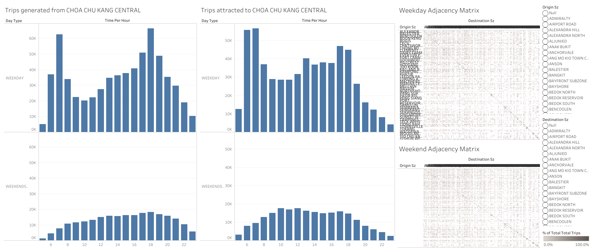
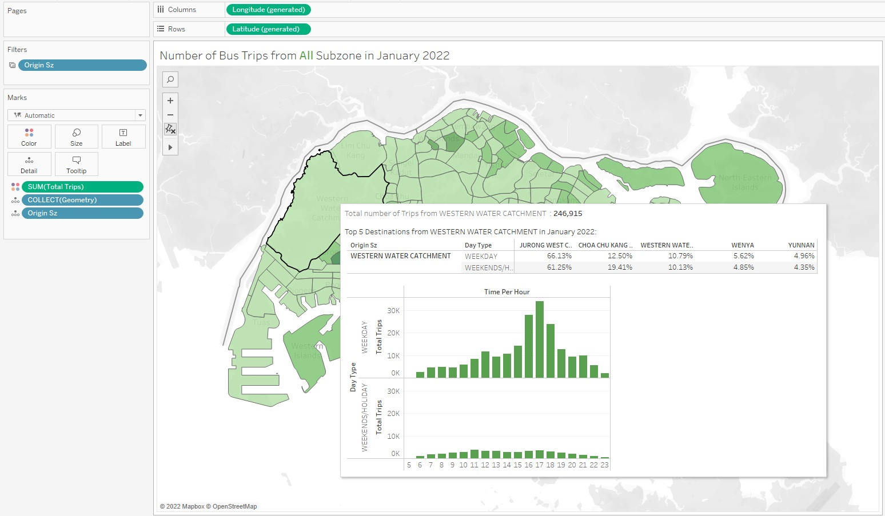
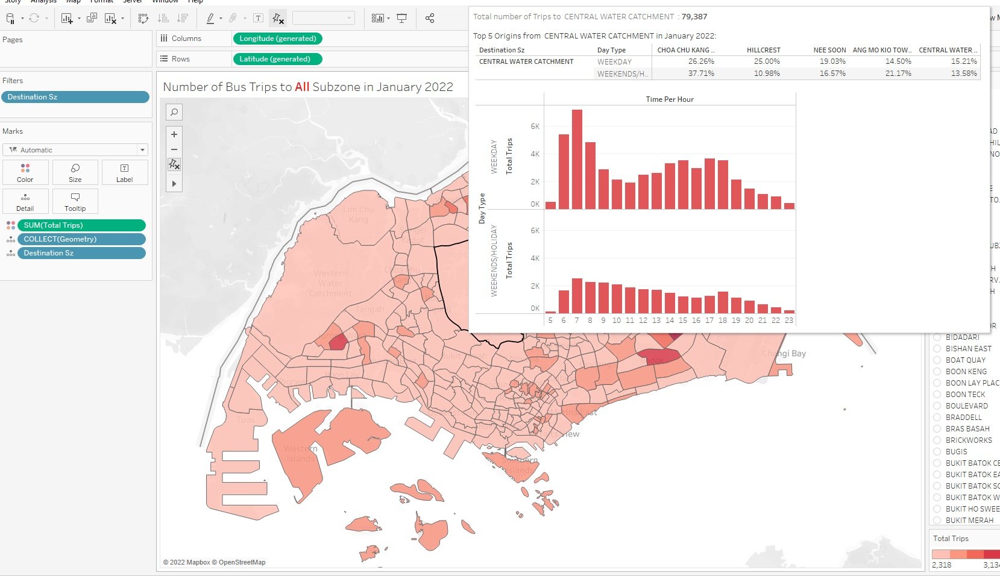
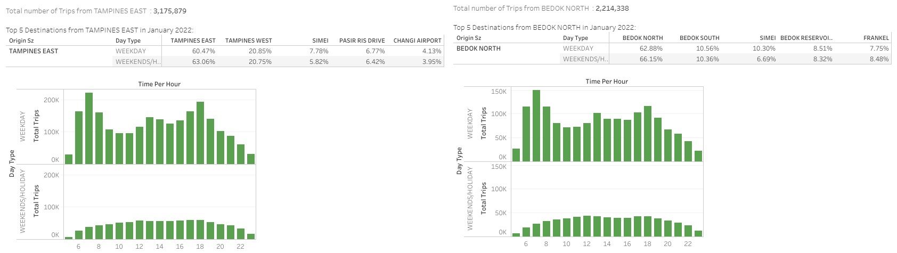
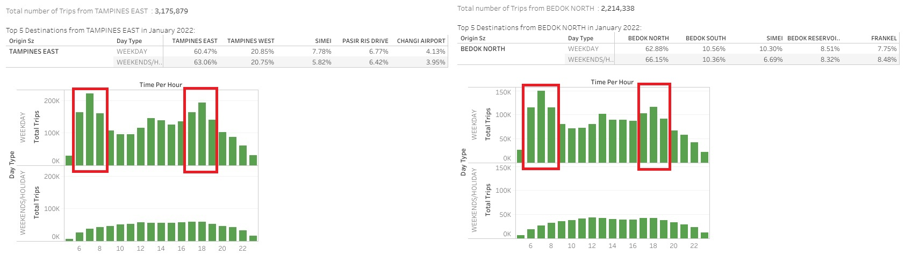

```{r setup, include=FALSE}
knitr::opts_chunk$set(echo = TRUE,
                      eval = TRUE,
                      warning = FALSE,
                      message = FALSE,
                      fig.retina = 3)
```

# 1. Critique of Visualisation

The data visualisation below was created from these two datasets. They are:

* *origin_destination_bus_SZ_202201.csv*, this data set was downloaded from LTA Datamall and URA region, planning area and planning subzone information were added by using GIS Overlay operation.

* *MP14_SUBZONE_WEB_PL*, this data provides URA Master Plan 2014 Planning Subzone boundary map in ESRI shapefile format. It was downloaded from data.gov.sg.

```{r, echo = FALSE, fig.align = 'center', out.width = '100%', results = 'markup'} 
  
```

This aim of this interactive data visualisation is to reveal inter- and intra-zonal public bus flows at the planning sub-zone level of January 2022. **As such, the critique below on clarity and aesthetics will be based on whether the interactive visualisation helped us make critical observations on these criteria** 


## 1.1 Clarity

### 1.1.1 Confusing Chart Titles

The chart titles "Trips generated from *location*" and 'Trips attracted to *location*" may not be the best as it gives rather vague representation of the graph below. It is not clear to the readers that the graphs represent both trips that originate from a certain location and trips that has a particular destination. 

*Suggested Revision* - Changing the chart titles

Title of the charts on the left should be "Trips with origin from *location*" and "Trips with destination at *location*'

Title should be "Resident Labour Force Participation Rate in Singapore by Age Groups from 2010 - 2021"

### 1.1.2 Missing Dashboard Title

The dashboard does not have a title so users who are using this dashboard would not have an idea on the overarching story that the visualisation is telling. With charts on the left and an adjacency matrix, readers will not be able to know that the dashboard is trying to analyse the inter- and intra-zonal public bus flows at the planning sub-zone level of January 2022

*Suggested Revision* - Adding in a dashboard title

A simple title like "Distribution of Bus Trips at Sub-zone level in January 2022" will give more clarity on the overall dashboard

### 1.1.3 Bad usage of Adjacency matrix

For a lay-man user with not much data analytics knowledge, an adjacency matrix may not be the best visualisation to depict the relationship between origins and destinations. A simple and more impactful visualisation should be used in its place for easy understanding and visualisation of the data.

*Suggested Revision* - Changing the adjacency into a Heatmap

A heatmap will give glance value to the analysis where anyone can immediately notice the top subzones with high bus trip origins and destinations.

### 1.1.4 No Data Source

The current visualisation does not include any data source which makes it unreliable.

*Suggested Revision* - Add in the data source

We can add in a text "Source: URA & data.gov.sg" to make the visualisation more credible

### 1.1.5 No insights annotation

The bus trip origin and destination charts on the left clearly shows a trend of having more riders during peak hours during weekdays and not during weekends. Additional insights annotation should be added to give readers a clearer picture on the data story.

*Suggested Revision* - Add in annotation under the title

We can add annotations "A higher number of rides are observed during peak hours on weekdays but no on weekends"

## 1.2 Aesthetics

### 1.2.1 Bad user of chart colors

Currently, both charts are in the same color no matter the origins or destination selected. It is rather confusing for the readers as they cannot easily tell the difference between each chart.

*Suggested Revision* - Adding in color for each location

We should filter each location into their own color so the readers can easily grasp how each chart is for a different location

### 1.2.2 Bad usage of graph space

The adjacency matrix is quite squeezed in the dashboard and we cannot see the entire adjacency matrix at a glance. The origin subzones cannot be seen entirely which makes the entire visualisation looks unpleasant to the eyes. As such, even though we have an impactful visualisation of relationship between origins and destination, we won't be able to see the entire relationship at a glance.

*Suggested Revision* - Compact the charts on the left and give more space to the adjacency matrix

Since the bus trip origins and destinations charts on the left are taking up huge amount of spaces, they can be compressed further and we will still be able to identify the relevant trends. By compressing it to the left, we will have more space for the full adjacency matrix to be shown on the right. 

### 1.2.3 Bad axis labelling for origin and destination charts on the left

The weekends/holiday label for the y-axis cannot be seen entirely. If our reader is not browsing closely, he will assume the graph at the bottom are depicting data for just the weekends and not for weekends and holidays.

*Suggested Revision* - Show the entire y-axis clearly

The entire Weekends/Holiday label should be fleshed out clearly

## 2. Improved Data Visualisation Sketch

```{r, echo = FALSE, fig.align = 'center', out.width = '100%', results = 'markup'} 
knitr::include_graphics("data/sketch.jpg")  
```

## 2.1 Advantages of Improved Data Visualisation Sketch

1. By using a heatmap for the main visualisation, readers can see at a glance the hotspots for bus flows at each sub-zone level. This is a better than using a more complex visualisation like adjacency matrix which may be confusing for non-data analytics natives.

2. We will still utilise the same charts from the original visualisation which gives the readers information with regards to ridership from origins and destinations of a particular destination.

3. Selections of subzones at the side will be properly sized so users are able to access all origins/destination subzones instead of having to scroll up and down for it.

4. By adding in a relevant dashboard title and annotations, readers can immediately identify the  overall trends in intra and inter zonal public bus flows.

## 3. Data Visualisation 

After downloading the dataset from elearn, we will need to stitch the origin destination csv file together with the subzone boundary map in Tableau before we can perform our visualisation.

## 3.1 Data Preparation

We first import the origin destination csv file by dragging it into Tableau together with the subzone boundary map. We link the files together as depicted in the image below

```{r, echo = FALSE, fig.align = 'center', out.width = '100%', results = 'markup'} 
knitr::include_graphics("data/image1.jpg")  
```

We then link the two datasets together by establishing a relationship between **'Origin Sz' & 'Subzone N'** and **'Destination Sz' & 'Subzone N'**.

```{r, echo = FALSE, fig.align = 'center', out.width = '100%', results = 'markup'} 
knitr::include_graphics("data/image2.jpg")  
```

## 4. Creating the Interactive Maps

We will be using some guidance from [**the information lab**](https://www.theinformationlab.co.uk/2020/09/14/how-to-create-an-origin-destination-map-in-tableau/) in the creation of our interactive map.

1. We start by dragging 'Geometry' into details to show the map of Singapore on the sheet

```{r, echo = FALSE, fig.align = 'center', out.width = '100%', results = 'markup'} 
knitr::include_graphics("data/map1.jpg")  
```

2. We add in 'Origin Sz' into the details, Sum(Total Trips) as our color for the map and edit the colors to 'Green'

```{r, echo = FALSE, fig.align = 'center', out.width = '100%', results = 'markup'} 
knitr::include_graphics("data/map3.jpg")  
```

3. We add in 'Origin Sz' as our filter

```{r, echo = FALSE, fig.align = 'center', out.width = '100%', results = 'markup'} 
knitr::include_graphics("data/map5.jpg")  
```

4. We repeat the steps above while replacing 'Origin Sz' with 'Destination Sz' in the details and 'Origin Sz' with 'Destination Sz' in the filters to create our Destination map

```{r, echo = FALSE, fig.align = 'center', out.width = '100%', results = 'markup'} 
knitr::include_graphics("data/map6.jpg")  
```

## 5. Creating the Origin and Destination Bus Charts

1. We convert 'Time Per Hour' attribute into 'Dimension' as it's wrongly classified by default

2. We drag 'Time Per Hour' into the columns, Day Type & Sum(Total Trips) into Rows to recreate the charts from the original visualisation

```{r, echo = FALSE, fig.align = 'center', out.width = '100%', results = 'markup'} 
knitr::include_graphics("data/chart1.jpg")  
```

3. We add in Time Per Hour and Origin Sz as filters while excluding 0-4 hours from Time Per Hour where buses are not available

```{r, echo = FALSE, fig.align = 'center', out.width = '100%', results = 'markup'} 
knitr::include_graphics("data/chart2.jpg")  
```

4. We then make some aesthetic edits to the charts by rotating the weekday/weekend labels, changing the chart title and also changing the color.

```{r, echo = FALSE, fig.align = 'center', out.width = '100%', results = 'markup'} 
knitr::include_graphics("data/chart3.jpg")  
```

5. We repeat the steps above while replacing 'Origin Sz' with 'Destination Sz' as filters to creation the Destination chart

```{r, echo = FALSE, fig.align = 'center', out.width = '100%', results = 'markup'} 
knitr::include_graphics("data/chart4.jpg")  
```

## 6. Creating the Top Destinations and Origins on tooltips

1. We create a new worksheet and drag 'Destination Sz' to columns, 'Origin Sz' and Day Type to Rows

2. We drag 'Sum(Total Trips)' into the worksheet

```{r, echo = FALSE, fig.align = 'center', out.width = '100%', results = 'markup'} 
knitr::include_graphics("data/tt1.jpg")  
```

3. We right click on 'Sum(Total Trips)' and click on quick calculation to set it as a percentage of total with table across and edit the 'Destination Sz' to feature only the top 5 results

```{r, echo = FALSE, fig.align = 'center', out.width = '100%', results = 'markup'} 
knitr::include_graphics("data/tt2.jpg")  
```

4. After which, we set the filter settings for Origin Map to match the Origin charts and the Destination Map to match the Destination charts

```{r, echo = FALSE, fig.align = 'center', out.width = '100%', results = 'markup'} 
knitr::include_graphics("data/db1.jpg")  
```

5. We then edit the tooltips for the Origin Map to include the top 5 destinations

```{r, echo = FALSE, fig.align = 'center', out.width = '100%', results = 'markup'} 
knitr::include_graphics("data/tt3.jpg")  
```

6. Now we can see the total number of trips, top destinations and the breakdown of weekday and weekend ridership at a glance

```{r, echo = FALSE, fig.align = 'center', out.width = '100%', results = 'markup'} 
  
```

7. We repeat the steps above to create a top origins chart and also edit the tooltips for our destination map

```{r, echo = FALSE, fig.align = 'center', out.width = '100%', results = 'markup'} 
  
```

## 7. Creating the Interactive Dashboard

1. We drag in the Origin Map and Destination onto the Tableau Dashboard

```{r, echo = FALSE, fig.align = 'center', out.width = '100%', results = 'markup'} 
knitr::include_graphics("data/db2.jpg")  
```

2. We add in the Dashboard titles, annotations and also data source with useful information for the readers

```{r, echo = FALSE, fig.align = 'center', out.width = '100%', results = 'markup'} 
knitr::include_graphics("data/db4.jpg")  
```

[**The public dashboard can be accessed here**](https://public.tableau.com/app/profile/mak.han.ren/viz/DatavizMakeover2_16483571473050/Dashboard1)

# 8. Observations

## 8.1 High Interzonal Activities

As we hover our mouse over Tampines East and Bedok North in the dashboard, we can see that the top 2 destinations of these subzones are in fact subzones just beside each other.

```{r, echo = FALSE, fig.align = 'center', out.width = '100%', results = 'markup'} 
  
```

Tampines East has the highest percentage of bus trips to Tampines East and Tampines West while Bedok North has the highest number of bus trips to Bedok North and Bedok South.

## 8.2 Regional Transport Hubs are residential areas

As identified from our dashboard earlier, Tampines East, Bedok North and Jurong West Central have the highest number of origin trips. From my external research, I came across an interesting article by Mr Pang Chin Eng with regards to the [**Geographic Distribution of Singapore Resident Population**](https://www.singstat.gov.sg/-/media/files/publications/population/ssnsep09-pg8-12.pdf).

```{r, echo = FALSE, fig.align = 'center', out.width = '100%', results = 'markup'} 
knitr::include_graphics("data/obs2.jpg")  
```

Even though slightly outdated, we can see that the residential populations of Bedok, Jurong West and Tampines are in fact the highest in Singapore. And in the paper, Pang delved deeper into why the populations of these areas will increase over time and attributed it to ageging population where people in these old estates tend to stay within their own area. As such, we can see how this relates to their children also living in these areas leading to high ridership of buses in this subzones.

## 8.3 High Destination Trips due to High Origin Trips

As we take a closer look at the number of trips during time per hour, we can easily identify the trend of more trips being taken during peak hours.

```{r, echo = FALSE, fig.align = 'center', out.width = '100%', results = 'markup'} 
  
```

The reason why there are significant number of trips to busy subzones like Tampines East and Bedok North can be attributed to people going home after a day of work.

## 8.4 Buses too crowded during peak hours

Drawing from the example earlier, we can see that there are easily more than 200,000 rides in Tampines East during the morning rush hour at 7am. Luckily, there has been steps on trying to ease the pressure on the bus system as the [**government has transformed Tampines into an integrated transport hub**](https://www.tampines.org.sg/Resources/Documents/OurTown/da0d2fed0ec241c3a9c9896158cedfc2.pdf).

```{r, echo = FALSE, fig.align = 'center', out.width = '100%', results = 'markup'} 
knitr::include_graphics("data/obs4.jpg")  
```

New MRT lines have been added in Tampines to entice users to use the MRT more often instead of taking the bus and also with improved bus networks at the same time. Ridership of bus is still quite high, but given the improvements in the transport network we can foresee a dip in bus ridership in the future as more residents move towards taking the MRT instead.


